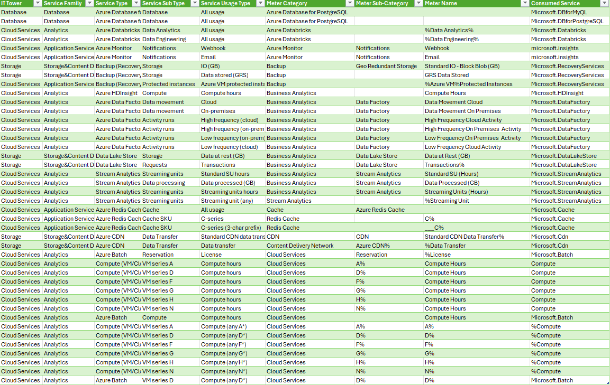

# Лабораторная работа 2
## Задание
Необходимо получить навыки аналитики и понимания спектра публичных облачных сервисов без привязки к вендору, для этого сопоставим входящие данные от провайдера с его же документацией. Напишем в соответствие колонкам справа значения 5 колонок слева, которые бы однозначно классифицировали тип сервиса. В ходе выполнения работы не будем отходить от принципов классификации, выбранных в Лабораторной работе 1
## Ход Работы
выполнил таблицу team10

Я приступил к выполнениню лабораторной работы 2, сразу стало понятно, что буду делать во многом похожие действия относильной первой лабораторной, только если в прошлой лабораторной я работал с AWS, то в этой с Azure. Также нужно было заполнить 5 характеризующих колонок, чтобы можно было по ним фильтровать таблицу и исследовать биллинг на разных уровнях детализации. Для данных использовал эти доки https://learn.microsoft.com/ru-ru/azure/?product=popular, а также просто поиск в гугле.

После первой лабораторной вторую было выполнять значительно легче. Из "дополнительной" сложности могу отметить, только сведение некоторых данных с первой лабораторной, чтобы использовалось одинаковое разбиение данных. 

И так, все сервисы Microsoft Azure были распределены по иерархии, благодаря этому таблица была приведена к кросс-провайдерной модели

## Выводы
Лабораторная была завершена, научился работать с Azure; была сформирована модель на основе признаковов биллинга azure (meter category, meter sub-category, meter name, consumed service). Полученная структура обеспечивает возможность аналитики и создаёт основу для сопоставимого анализа сервисов AWS и Microsoft Azure