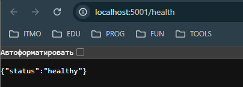
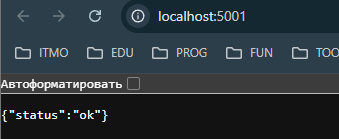
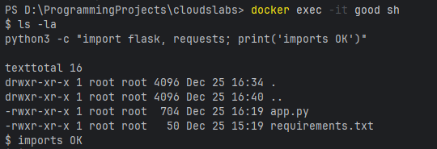

# Лабораторная работа 2
## Задание
Необходимо было создать 2 докер файла и показать на практике различия
между хорошими и плохими практиками
## Ход работы
Я приступил к выполнению лабораторной работы и сразу стало
понятно, что разбираться буду очень долго. Во-первых, я установил,
сам Docker, для этого также был установлен wsl. Саму работу буду выполнять
в ide Pycharm. 

В итоге у меня должно получиться 2 докера: хороший и плохой.
Решил использовать Flask, для того, чтобы контейнер запускал реальное приложение. У файла app.py
несколько эндпоинтов: '/' - главная страница,"/health" — для healthcheck, "/version" — тестовый эндпоинт.

"requirements.txt" нужен, чтобы зависимости устанавливались предсказуемо и одинаково везде: и локально, и в контейнере. В моём проекте зависимости зафиксированы версиями

Плохой Dockerfile (bad.Dockerfile):
Что в нём было сделано намеренно “плохо”

В "bad.Dockerfile" я специально оставил несколько bad practices, чтобы было что исправлять в хорошем варианте.

1) Использование ubuntu:latest  
тег `latest` меняется со временем, и сборка становится не воспроизводимой (сегодня одно окружение, потом другое). Плюс Ubuntu — не специализированный Python‑образ, приходится вручную ставить Python и pip.
   (+ c этой проблемой я и столкнулся, когда тестировал докеры)

2) Установка лишних пакетов в контейнер (`vim`, `nano`, `htop`, `net-tools` и т.д.)  
это раздувает размер образа и добавляет лишние утилиты внутрь контейнера, которые не нужны приложению в продакшене. 

3) Установка Python‑зависимостей прямо в Dockerfile без `requirements.txt`
список зависимостей “зашит” в Dockerfile, версии не зафиксированы, кеширование слоёв работает хуже (при изменениях в коде всё может пересобираться дольше). 

4) **Запуск от root**  
root‑права внутри контейнера увеличивают риски при уязвимостях приложения и в целом считаются плохой практикой.
Что у меня всплыло при сборке bad.Dockerfile (важный практический момент)

При сборке bad‑образа я столкнулся с ошибкой externally-managed-environment на этапе pip install. Это связано с тем, что в некоторых базовых Linux‑окружениях системный Python запрещает устанавливать пакеты через pip “в систему” без специальных действий (виртуальное окружение/разрешающий флаг).

Хороший Dockerfile (good.Dockerfile)

В good.Dockerfile я исправил плохие практики из bad.Dockerfile. Важные изменения:

1) база под Python
Я использую python:3.11-slim вместо ubuntu:latest. Это уменьшает образ и делает окружение предсказуемым. 

2) Минимум пакетов
Ставлю только то, что нужно (например, curl для healthcheck), и использую подход, уменьшающий “мусор” внутри контейнера. 
3) Правильная установка зависимостей через requirements
Сначала копируется requirements.txt, затем выполняется pip install -r requirements.txt, и только потом копируется код приложения. Это улучшает кеширование слоёв и ускоряет повторные сборки. 

4) Запуск не от root
Создаю отдельного пользователя и запускаю приложение от него.

5) healthcheck
Добавил healthcheck, который обращается к health, чтобы Docker мог показывать состояние контейнера как healthy/unhealthy. 

После перехода на “хороший” Dockerfile я получил:
- более компактный образ,
- более предсказуемые зависимости,
- более безопасный запуск (не root),
- проверку здоровья контейнера через healthcheck,
- удобную проверку работоспособности приложения через HTTP.

## Две плохие практики при работе с контейнерами (не про Dockerfile)

Даже если Dockerfile хороший, можно всё испортить на этапе запуска и эксплуатации контейнеров. Я выделил две частые проблемы. 

### Хранить данные только внутри контейнера (без volumes)

Если контейнер удалить и создать заново, данные, которые лежали внутри, пропадут. Это критично для баз данных и любых файлов, которые должны сохраняться.

Как правильно: использовать volume или bind mount, чтобы данные жили вне контейнера

### Пароли или токены в самом dockerfile

Плохая практика — прописывать пароли/токены прямо в Dockerfile или передавать их “как попало” (так, что их легко посмотреть через inspect/логи/историю команд). 

Как лучше: использовать .env (локально и не коммитить) или секрет‑хранилища (в зависимости от окружения). 

## Как я проверял, что всё работает
Сначала я проверил установку простым образом:

Сборка образов:

Запуск:

## Выводы
Хоть работа была довольно сложной, но вроде бы всё получилось. Сталкнулся я с множеством проблем, большая часть которых была
по невнимательности. Я сделал хороший и плохой докеры, а также образы. 
