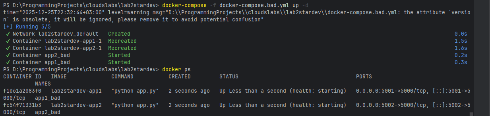
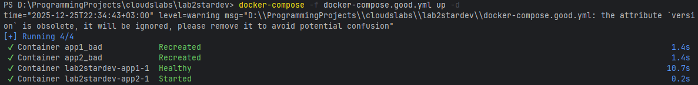
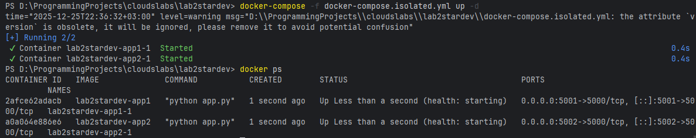
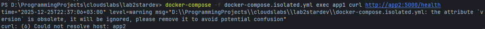
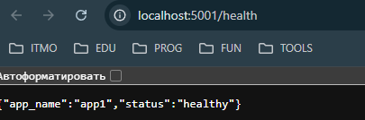
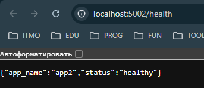

# Лабораторная работа 2*
## Задание
В этой лабораторной работе необходимо продолжить изучать docker, 
продемонстрировать, как правильная конфигурация Docker Compose влияет на надёжность, безопасность и масштабируемость многоконтейнерных приложений, а также понять принципы работы сетевой изоляции в Docker.

## Ход Работы
Начав делать эту работу, я думал (из-за того, что сделал предыдущую), что эта будет легче,
но оказалось, что она сложнее. В ходе выполнения столкнулся с множеством проблем, некоторые их которых я опишу.
Так вот, в этой лабораторной я также использую некоторые файлы из предыдущей.

Плохой Docker Compose (docker-compose.bad.yml):
1) Жёсткие имена контейнеров (container_name) - Если запустить Compose несколько раз (например, в разных окружениях), второй запуск упадёт с ошибкой "имя уже занято"; Невозможно масштабировать услугу (команда docker-compose up --scale app1=3 не сработает); При использовании в CI/CD конвейерах это создаёт конфликты имён
2) Нет явной конфигурации сети - По умолчанию Docker Compose создаёт одну bridge-сеть и подключает к ней все сервисы. Контейнеры автоматически видят друг друга по имени сервиса; Неявная конфигурация: разработчик может не знать о сетевой доступности; Нарушение принципа "least privilege" (наименьшие привилегии) — каждый контейнер имеет доступ ко всем остальным по умолчанию; Сложнее отлаживать неожиданное сетевое взаимодействие
3) Нет healthcheck и зависимостей между сервисами - Если app2 зависит от app1, она может стартовать раньше, пока app1 ещё инициализируется; Docker не знает, здоров ли контейнер, и не может его перезагрузить при сбое; Непредсказуемое поведение при перезагрузке контейнеров;
4) Без переменных окружения и hardcode конфигурации - Нельзя менять порты без редактирования YAML; Одна конфигурация для всех окружений (dev, staging, prod); Сложно переносить проект между машинами;
5) Нет restart policy - При сбое контейнер остаётся в состоянии "Exited" без автоматического перезапуска; В production это приводит к простоям сервиса

| Bad Practice               | Исправление             | Результат                                          |
| -------------------------- | ----------------------- | -------------------------------------------------- |
| container_name: app*       | Убрано                  | Поддержка масштабирования и множественных запусков |
| Нет явной сети             | Добавлены networks:     | Явная архитектура, лучший контроль доступа         |
| Нет healthcheck/depends_on | Добавлены оба           | Правильный порядок запуска, автоперезагрузка       |
| Hardcode портов            | Использованы переменные | Портативность между окружениями                    |
| Нет restart policy         | restart: unless-stopped | Высокая доступность                                |

Docker Compose с сетевой изоляцией (docker-compose.isolated.yml):
Каждый сервис подключен к своей собственной bridge-сети (net-app1 и net-app2).
Сервисы не делят одну сеть, поэтому не могут резолвить друг друга по имени. Когда Docker Compose запускает контейнеры, каждый получает IP-адрес в своей сети. DNS resolver внутри контейнера ищет имена только в той сети, к которой подключен контейнер

### Демонстрация:
Запуск bad-compose и проверка видимости:

Проверка видимости (контейнеры видят друг друга):

Запуск good-compose и проверка видимости:

Запуск isolated-compose и проверка изоляции:

Проверка изоляции (контейнеры НЕ видят друг друга):

Но через хост (проброшенные порты) можно обратиться к обоим:

## Заключение
Наглядно увидел, как происходит изоляция, а также как best practices положительно влияют на docker